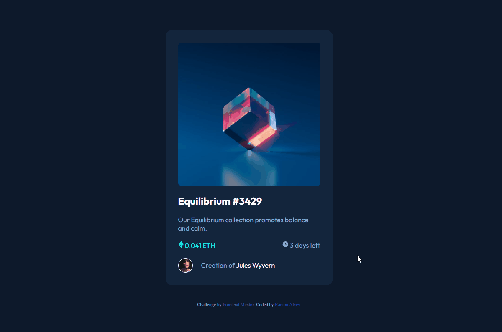
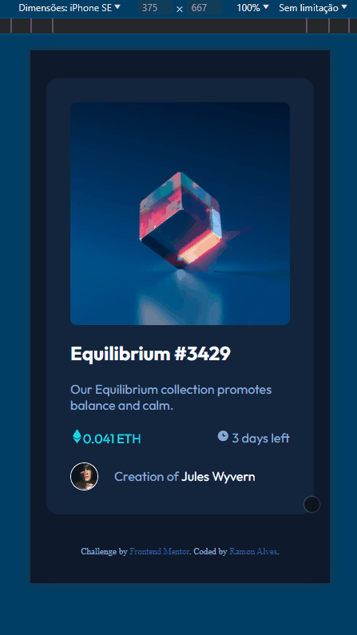

# Frontend Mentor - NFT preview card component solution

This is a solution to the [NFT preview card component challenge on Frontend Mentor](https://www.frontendmentor.io/challenges/nft-preview-card-component-SbdUL_w0U). Frontend Mentor challenges help you improve your coding skills by building realistic projects. 

## Overview

It's a simple a NFT preview card that contains:
- NFT Image;
- NFT Name;
- Description;
- Value;
- Time left;
- NFT Creator

### The challenge

Users should be able to:

- View the optimal layout depending on their device's screen size
- See hover states for interactive elements

## Screenshot

- ### Desktop


- ### Mobile



### Links

- Solution URL: [FrontEnd Mentor](https://www.frontendmentor.io/solutions/-html5-e-css-7-newbie-nft-preview-card-rKXSoorklk)
- Live Site URL: [Live Site](https://ramon-alvez.github.io/Frontend-Mentor-HTML-CSS-Newbie-NFT-Preview-Card/)

## My process

### Built with

- Semantic HTML5 markup
- CSS custom properties
- Flexbox

### What I learned

I learned how to create a mask to overlay an image with the hover effect in the link, and that I need to review the absolute and relative position classes 😅

Here's the specific part:

```css
.card 
    .image{
        position: relative;
        display: flex;
}

.card .image:hover:before{
    content: '';
    display: flex;
    position: absolute;
    width: 100%;
    height: 100%;
    border-radius: 8px;
    transition: 0.4s ease-in-out;

    background-color: var(--Active);
    opacity: 0.6;
}

.card .image:hover::after{
    content: '';
    display: flex;
    position: absolute;
    width: 100%;
    height: 100%;
    background: url(../images/icon-view.svg) no-repeat center;
    transition: 0.4s ease-in-out;

    cursor: pointer;
}

```

### Continued development

I intend to continue doing the frontend mentor challenges until I finish them all, and learning with the process ;D.

## Author

- GitHub - [Ramon Alvez](https://github.com/Ramon-Alvez)
- Frontend Mentor - [@Ramon Alvez](https://www.frontendmentor.io/profile/Ramon-Alvez)
- LinkedIn - [@Ramon Alvez](https://www.linkedin.com/in/ramon-alvez/)

**Note: Delete this note and add/remove/edit lines above based on what links you'd like to share.**

## Acknowledgments


I give credit for solving the mask part of the link to ***@Dev-em-Dobro***
